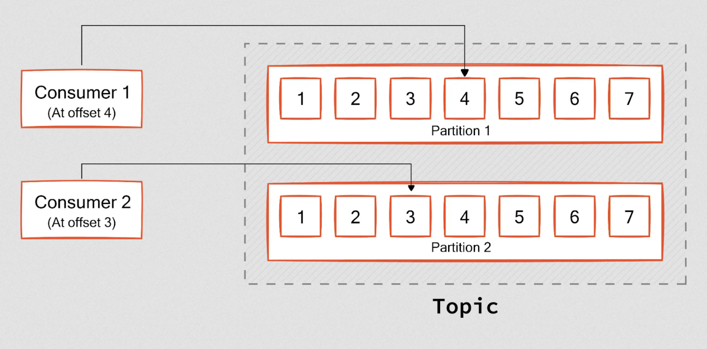

# [Apache Kafka Overview](<https://kafka.apache.org/intro>)

[kafka design docs](https://kafka.apache.org/documentation/#design)

What is apache kafka?

- Apache Kafka is a distributed streaming platform that is used publish and subscribe to event streams.
- event streams - capture real-time data from event sources like databases, sensors, mobile devices, cloud services, and software application.
- capabilities include captureing event streams, storing them durably for as long as needed, processing and reacting to events, and routing the event streams to different destinations.

- Event stream use cases:
  - payment processing and real time financial transactions, banks, stocks
  - monitoring cars, trucks, fleets and shipments in logistics industry
  - capture and analyze sensor data in real time from IOT devicies, factories
  - Collect and react to customer interactions and orders in retail, hotel, travel
  - Monitor patients in hospital care and predict patient outcomes
  - Foundation for microservices, event driven architecture and real time analytics
  
How does Kafka work?

- It is a distributed system consisting of servers and clients that communicate via a custom high-performance TCP network protocol.
-

Components of Kafka:

Servers:

- broker - Kafka server that stores data and serves clients
- zookeeper - Kafka uses Zookeeper to manage the cluster. Zookeeper is a distributed coordination service that Kafka uses to manage and coordinate brokers.
- controller - Kafka broker that is responsible for managing the state of partitions and replicas and for performing administrative tasks like reassigning partitions and electing leaders.
- kafka connect - server that imports and exports data as event streams to and from relationa databases and other systems.
- clients - integrate various languages with kafka

Main Concepts:

- Event - an event records the fact something happened. It is also called a record or message. Kafka writes data in the form of events. Events have a key, value, timestamp, and metadata headers. Events are processed exactly once.
- Producer - applications that write/publish events to Kafka. The producer sends data directly to the broker that is the leader for the partition without any intervening routing tier. To help the producer do this all Kafka nodes can answer a request for metadata about which servers are alive and where the leaders for the partitions of a topic are at any given time to allow the producer to appropriately direct its requests.
- Consumer - applications that subscribe/read and process events. Producers and consumers are fully decoupled from each other. The Kafka consumer works by issuing "fetch" requests to the brokers leading the partitions it wants to consume. The consumer specifies its offset in the log with each request and receives back a chunk of log beginning from that position. The consumer thus has significant control over this position and can rewind it to re-consume data if need be. Every consumer has a consumer group.
- Broker - a kafka server/container that receives and stores messages from a producer and stores them durably. Brokers save data to disk. data is pushed to the broker from the producer and pulled from the broker by the consumer. One broker serves as the controller. Each broker hosts some set of partitions nd handles incoming requests to write new events to those partitions, read events, and handle replication between each other.
- Topic - events are stored in topics. Topics are like folders and events like files in a folder. Topics are multi-producer and multi-subscriber. Events in a topic can be read as often as needed. Unlike traditional message queues, events are not deleted after consumption, you define for how long Kafka should retain events via per-topic config settings. Old events are discarded. Storing data is fine, as performance is constant with respect to data size.
- Partition - Topics are divided into partitions, meaning it is spread over a number of buckets on different kafka brokers. This distributed placement of your data is very important for scalability because it allows client applications to both read and write the data from/to many brokers at the same time. To make your data fault-tolerant and highly-available, every topic can be replicated, even across geo-regions or datacenters, so that there are always multiple brokers that have a copy of the data just in case things go wrong, you want to do maintenance on the brokers, and so on. A common production setting is a replication factor of 3, i.e., there will always be three copies of your data. When a new event is published to a topic, it is actually appended to one of the topic's partitions. Events with the same event key (e.g., a customer or vehicle ID) are written to the same partition, and Kafka guarantees that any consumer of a given topic-partition will always read that partition's events in exactly the same order as they were written.
- Offset -  an offset is a unique identifier assigned to each record (message) within a partition of a Kafka topic. the Kafka offset represents the position of a message within that partition’s log. It indicates how far the message is from the beginning of the partition log. Kafka uses offsets to track messages from initial writing to final processing completions.  Ofsets are stored persistently by Kafka, allowing consumers to resume from a specific point in the event of a failure. Every consumer notifies kafka by committing the offset information it has processed. Please note, offset is unique only within a partition, not across partitions.

- Zookeeper
- Consumer Group - A consumer group is a set of consumers that consume from the same topic. Kafka ensures that a partition is assigned to only one consumer at a time. This helps Kafka remove the complexities of sharing messages within a single partition with multiple consumers. The only remaining problem is ensuring the consumers get reliable data from the assigned partitions. This is where offsets come into the picture. Kafka uses offsets to track messages from initial writing to final processing completions.
-
- Replication - Kafka replicates the log for each topic's partitions across a configurable number of servers (set by per topic replication factor). This allows automatic failover to replicas if a server in the cluster fails so messages remain available. The unit of replication is the topic partition. Each partition has a single leader and zero or more followers; the total numbmer of replicas including the leader consitute the replication factor.
- Leaders and followers in replication - In kafka, when replicating a topic's partitions, all writes go to the leader of the partition. Reads go to the leader or follower. There are many more partitions than brokers, and leaders are distributed evenly among brokers. Logs on the leader and follower are identical and have the same offsets and messages, but the leader may have a few unreplicated messages at the end of its log. Followers pull and consume messages from the leader and allows them to batch together log entries. During a failure, only members from the ISR are eligible for election as leader because the ISR (i.e. In sync replicas) is by definition caught up to the leader. A write to a Kafka partition is not considered committed until all in-sync replicas have received the write. This ISR set is persisted in the cluster metadata whenever it changes. Because of this, any replica in the ISR is eligible to be elected leader.
  
- Controller - A special node in kafka that is responsible for managing the registration of brokers in the cluster. In order to be considered "Active" - a Broker must maintain an active session with the controller to receieve meta data updates (an active session is often maintained via heartbeat checks) and brokers acting as followers must replicate writes from the leader and not fall too far behind. Nodes satisfying these conditions are considered "in sync" and referred to as the ISR (in sync replicas). when a follower dies or falls too far behind (.i.e. replica lag time exceeds max configuration), it is removed from the ISR.
-
- Messages are considered commited when all replicas in the ISR for that partition have applied it to their log. Only commited messages are given out to the consumer, consumers don't need to worry about missing messages if a leader fails.
- Producers can wait for messages to be commited or not depending on their trade off for latency and durabilty, as controlled by the acks setting the producer users. Kafka guarantees that a committed message will not be lost, as long as there is at least one in sync replica alive, at all times.

-

Problems:

- consumer lag - One of Kafka's key performance indicators is consumer lag. It represents the difference between the committed offset and the log-end offset. A minimal lag between log-end offset and committed offset is expected during normal operations. However, if the lag increases, it may break the system. The most common reason for high lag is unpredictable surges in incoming messages, as well as uneven data distribution across partitions, and slow processing jobs.
- Kafka splits data into partitions by considering the hash of the message key. If you customize the message key and the message volume with a specific key is higher than others, the consumer catering to that partition experiences a high load, leading to high lag.

What if all the replicas and leaders die?

- This is a simple tradeoff between availability and consistency. If we wait for replicas in the ISR, then we will remain unavailable as long as those replicas are down. If such replicas were destroyed or their data was lost, then we are permanently down. If, on the other hand, a non-in-sync replica comes back to life and we allow it to become leader, then its log becomes the source of truth even though it is not guaranteed to have every committed message. By default from version 0.11.0.0, Kafka chooses the first strategy and favor waiting for a consistent replica.
